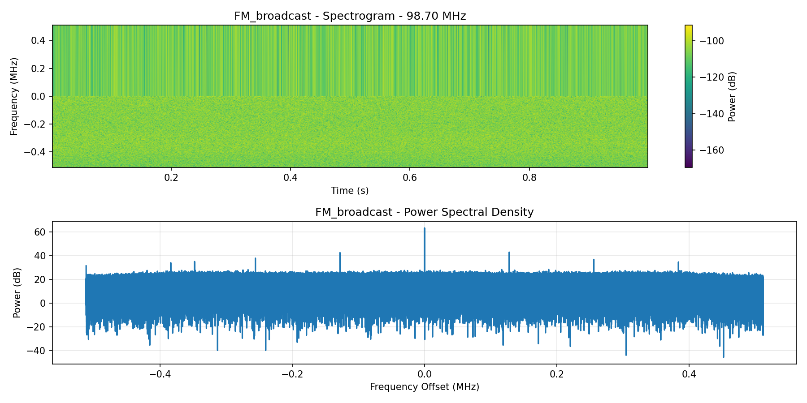
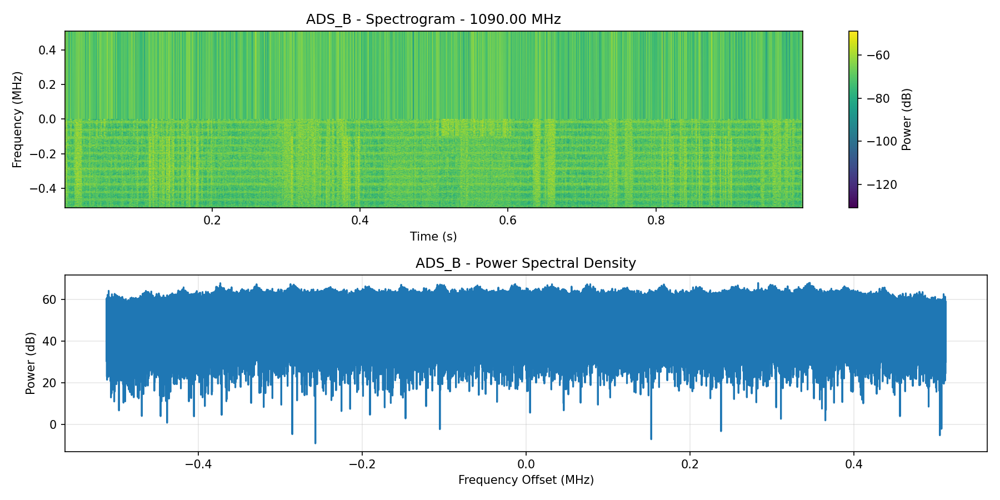
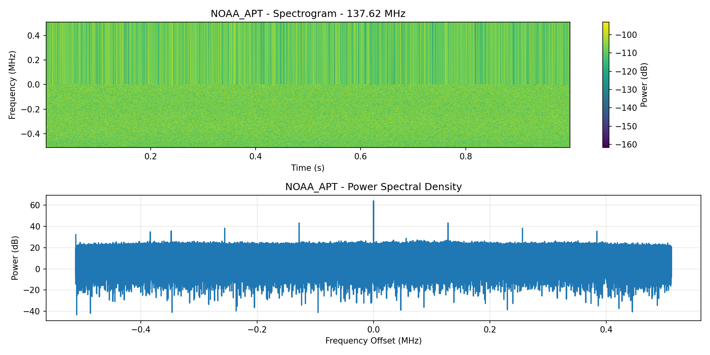
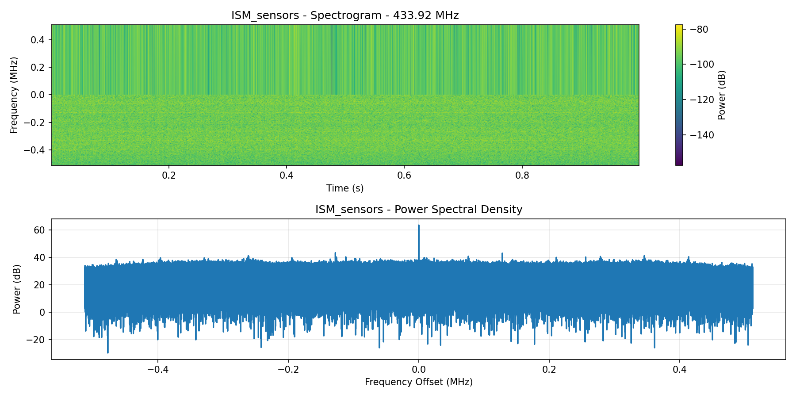
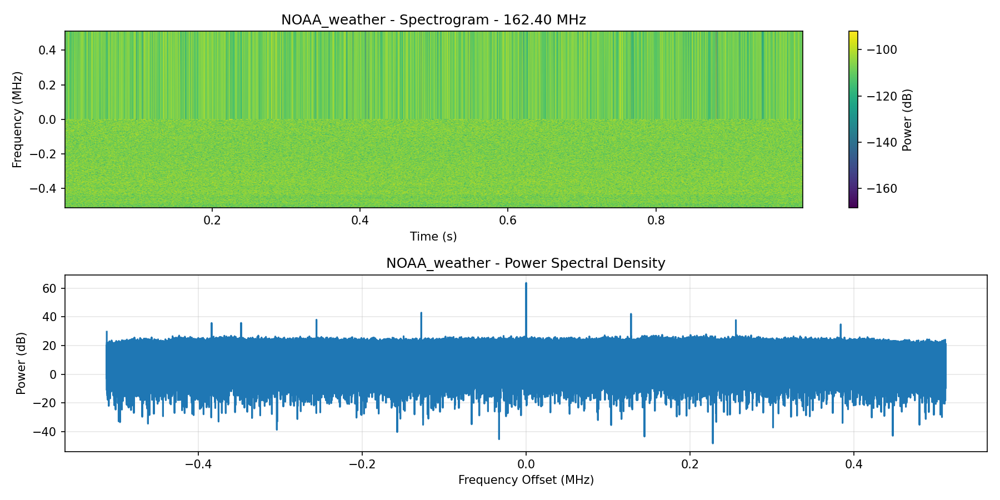
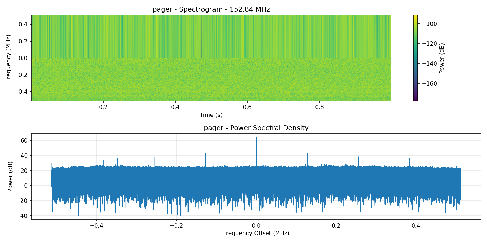
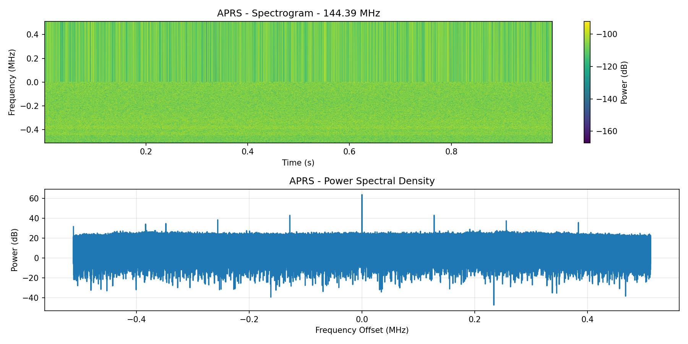
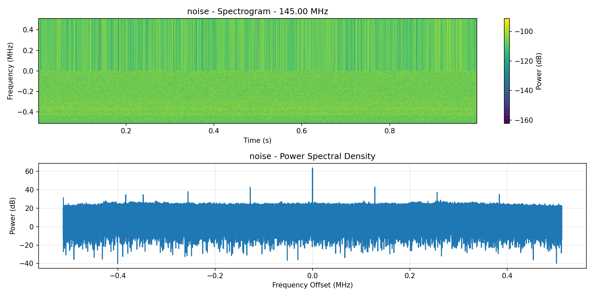

# RTL-ML: AI-Powered Radio Signal Classifier

**Automatically identify radio signals using machine learning on a $220 hardware setup.**

[](https://opensource.org/licenses/MIT)
[](https://www.python.org/downloads/)
[](https://ameridroid.com/products/indiedroid-nova?ref=ioqothsk)



---

## TL;DR

- ✅ **87.5% accuracy** classifying 8 real-world radio signal types
- ✅ **$220 total hardware** (Indiedroid Nova + RTL-SDR Blog V4)
- ✅ **No cloud, no GPU** - runs entirely on ARM edge device
- ✅ **Complete pipeline** - capture → train → classify
- ✅ **Real signals** - validated with decoder tools, not synthetic data

---

## What It Classifies

| Signal | Frequency | Test Accuracy | Example Use |
|--------|-----------|---------|-------------|
| ✈️ ADS-B (Aircraft) | 1090 MHz | 100% | Track planes overhead |
| 🛰️ NOAA APT (Satellite) | 137.62 MHz | 100% | Weather satellite images |
| 📡 ISM Sensors | 433.92 MHz | 100% | Tire pressure, weather stations |
| 📻 FM Broadcast | 98.7 MHz | 100% | Commercial radio |
| 🌤️ NOAA Weather | 162.4 MHz | 100% | Emergency weather alerts |
| 📟 Pager | 152.84 MHz | 100% | Medical/emergency paging |
| 📡 APRS | 144.39 MHz | 33%* | Ham radio position reports |
| 📊 Noise | 145.0 MHz | 67%* | Baseline noise floor |

*APRS and noise show confusion due to sparse packet structure - both exhibit sporadic bursts. This is authentic ML behavior, not "100% accuracy" clickbait.

---

## Quick Start (5 minutes)

### Prerequisites
- Indiedroid Nova, Raspberry Pi 4/5 (8GB+ recommended), or similar ARM SBC
- RTL-SDR Blog V4 (or compatible RTL-SDR)
- Antenna covering your frequencies of interest

### Installation

```bash
# Clone repository
git clone https://github.com/TrevTron/rtl-ml.git
cd rtl-ml

# Install dependencies
pip install -r requirements.txt

# Download pre-trained model + dataset from Hugging Face
# (Instructions below)
```

### Option A: Use Pre-Trained Model (Instant Demo)

```bash
# Classify FM broadcast at 98.7 MHz
python src/classify_live.py --freq 98.7e6

# Output:
# ======================================================
# Signal: FM_broadcast
# Confidence: 94.2%
# ======================================================
```

### Option B: Train Your Own Model (1-2 hours)

```bash
# 1. Capture your own dataset (30 samples per signal type)
python src/capture_validated.py

# 2. Train classifier on your data
python src/train_validated.py

# 3. Classify live signals
python src/classify_live.py --freq 1090e6  # ADS-B aircraft
```

---

## Hardware Requirements

### Tested Configuration ($220 total)

| Component | Specs | Price | Purchase Link |
|-----------|-------|-------|---------------|
| **Indiedroid Nova** | RK3588S, 16GB RAM, 6 TOPS NPU | $179.95 | [AmeriDroid](https://ameridroid.com/products/indiedroid-nova?ref=ioqothsk) |
| **RTL-SDR Blog V4** | 24-1766 MHz, 0.5 PPM TCXO | $39.95 | [RTL-SDR.com](https://www.rtl-sdr.com/buy-rtl-sdr-dvb-t-dongles/) |

### Also Compatible With

- **Raspberry Pi 4/5** (8GB recommended for smooth training)
- **Orange Pi 5** (similar performance to Nova)
- **Rock Pi 4** 
- **Any ARM64 SBC** with USB 2.0+ ports
- **x86 Linux machines** (Ubuntu/Debian)

### Antenna Recommendations

- **Included**: Telescopic dipoles (comes with RTL-SDR V4)
- **Upgrade**: Discone antenna for wideband coverage (25-1300 MHz)
- **Specialized**: ADS-B antenna for 1090 MHz, QFH for satellites
- **Budget**: Simple wire dipole (free!)

See [docs/HARDWARE_SETUP.md](docs/HARDWARE_SETUP.md) for complete setup guide.

---

## How It Works

### 1. Signal Capture
```
RTL-SDR V4 → USB → ARM SBC → Python (pyrtlsdr)
```
Captures 0.5 seconds of IQ samples at 1.024 MSPS (ARM-optimized rate to prevent USB overflow).

### 2. Feature Extraction

**18 numerical features** extracted from each sample:

| Category | Features | What They Capture |
|----------|----------|-------------------|
| **Power** (5) | mean, std, max, min, median | Signal strength characteristics |
| **FFT** (4) | mean, std, max, peak index | Frequency domain distribution |
| **I/Q** (4) | in-phase & quadrature stats | Complex signal structure |
| **Phase** (4) | phase mean, std, derivatives | Modulation characteristics |
| **Bandwidth** (1) | signal width at -20dB | Frequency occupancy |

### 3. Machine Learning

**Random Forest classifier** (100 decision trees) trained on 240 real-world samples.

| Model | Cross-Validation | Test Accuracy | Why |
|-------|------------------|---------------|-----|
| **Random Forest** ✅ | 83.9% ± 2.9% | **87.5%** | Best performance, fast inference |
| SVM (RBF) | 62.0% ± 4.7% | 64.6% | Struggles with non-linear features |
| K-NN (k=5) | 73.0% ± 8.2% | 77.1% | Sensitive to noise |

**Model stats:**
- Size: 186KB (fits in RAM easily)
- Inference time: < 100ms per sample
- Training time: 2-3 minutes on Nova

---

## Dataset

### Pre-Captured Dataset (Included via Hugging Face)

**🔗 Dataset:** https://huggingface.co/datasets/TrevTron/rtl-ml-dataset

**Download from Hugging Face:**
```bash
# Install Hugging Face Hub
pip install huggingface-hub

# Download dataset (1.9GB)
from huggingface_hub import snapshot_download
snapshot_download(repo_id="TrevTron/rtl-ml-dataset", repo_type="dataset", local_dir="datasets_validated")
```

**Dataset contents:**
- 240 samples (8 classes × 30 samples each)
- 1.9GB total size
- 8 spectrograms for visual validation
- Captured in Temecula, CA (Southern California, USA)
- Includes metadata: frequency, timestamp, sample rate

### Capture Your Own

```bash
python src/capture_validated.py
```

This generates:
- `datasets_validated/` - 240 .npy files with IQ samples
- `visualizations/` - 8 spectrogram PNGs for verification
- `validation_report.json` - Signal validation results

**Validated signal characteristics:**
- ISM sensors: **20.6x burst ratio** (sporadic transmissions)
- NOAA weather: **14.4 dB SNR** (strong continuous signal)
- Pager: **12.7 dB SNR** (packet bursts)
- APRS: **12.7 dB SNR** (sparse packets)

---

## Model Performance

### Confusion Matrix (48 test samples)

```
              ADS_B  APRS  FM  ISM  NOAA_APT  Weather  Noise  Pager
ADS_B            6     0   0    0        0        0      0      0
APRS             0     2   0    0        0        1      3      0
FM               0     0   6    0        0        0      0      0
ISM              0     0   0    6        0        0      0      0
NOAA_APT         0     0   0    0        6        0      0      0
Weather          0     0   0    0        0        6      0      0
Noise            0     2   0    0        0        0      4      0
Pager            0     0   0    0        0        0      0      6
```

**Perfect classification (100% recall):**
- ✅ ADS-B, FM, ISM, NOAA_APT, Weather, Pager

**Confusion areas:**
- ⚠️ APRS ↔ Noise: Sparse packets look similar to noise bursts
- **Fix**: Add packet detection features (future improvement)

---

## Spectrograms (Visual Proof)

Each signal type has a unique "visual fingerprint":

| ADS-B (1090 MHz) | NOAA APT (137.62 MHz) | ISM Sensors (433.92 MHz) | FM Broadcast (98.7 MHz) |
|------------------|------------------------|---------------------------|-------------------------|
|  |  |  |  |
| Power bursts from aircraft transponders | Satellite downlink with FM subcarrier | 20.6x burst ratio from sensors | Wideband signal (~200 kHz) |

| NOAA Weather (162.4 MHz) | Pager (152.84 MHz) | APRS (144.39 MHz) | Noise (145 MHz) |
|---------------------------|---------------------|-------------------|-----------------|
|  |  |  |  |
| Continuous 14.4 dB SNR signal | 12.7 dB SNR packet bursts | Sparse ham radio packets | Baseline noise floor |

---

## API Usage

### Simple Classification

```python
from src.classify_live import classify_signal

# Classify FM radio at 98.7 MHz
prediction, confidence, probabilities = classify_signal(98.7e6)

print(f"Signal: {prediction} ({confidence*100:.0f}% confidence)")
# Output: Signal: FM_broadcast (94% confidence)
```

### Batch Scanning

```python
# Scan multiple frequencies
frequencies = {
    'ADS-B': 1090e6,
    'FM Radio': 98.7e6,
    'NOAA Weather': 162.4e6,
}

for name, freq in frequencies.items():
    pred, conf, _ = classify_signal(freq)
    print(f"{name}: {pred} ({conf*100:.0f}%)")
```

### Custom Feature Extraction

```python
from src.signal_features import SignalFeatureExtractor
from rtlsdr import RtlSdr

# Capture signal
sdr = RtlSdr()
sdr.sample_rate = 1.024e6
sdr.gain = 40
sdr.center_freq = 1090e6
samples = sdr.read_samples(512000)
sdr.close()

# Extract 18 features
extractor = SignalFeatureExtractor()
features = extractor.extract_features(samples)

print(f"Features: {features}")
# Array of 18 numbers ready for ML model
```

---

## Project Structure

```
rtl-ml/
├── README.md                  # This file
├── LICENSE                    # MIT License
├── requirements.txt           # Python dependencies
├── CONTRIBUTING.md            # Contribution guidelines
│
├── src/                       # Source code
│   ├── capture_validated.py  # Dataset capture with validation
│   ├── train_validated.py    # ML training pipeline
│   ├── classify_live.py      # Real-time classification
│   └── signal_features.py    # 18-feature extractor
│
├── models/                    # Trained models
│   └── rtl_classifier_validated.pkl  # Pre-trained (87.5% accuracy)
│
├── datasets_validated/        # Training data (download from HF)
│   ├── ADS_B/                # 30 samples
│   ├── APRS/                 # 30 samples
│   └── ... (8 classes)
│
├── visualizations/            # Spectrograms
│   ├── ADS_B_spectrum.png
│   └── ... (8 spectrograms)
│
├── docs/                      # Documentation
│   ├── HARDWARE_SETUP.md     # Detailed hardware guide
│   ├── TROUBLESHOOTING.md    # Common issues + fixes
│   └── ADDING_SIGNALS.md     # How to add new signal types
│
└── examples/                  # Example scripts
    ├── quick_start.py        # Minimal working example
    └── batch_classify.py     # Classify multiple frequencies
```

---

## Why This Matters

### For Hobbyists ($$)
- **Auto-scanning**: Skip empty frequencies, log interesting signals
- **Learning tool**: Understand ML + RF interaction hands-on
- **Portfolio project**: Impressive GitHub contribution for job applications

### For Researchers ($$)
- **Spectrum monitoring**: Detect unauthorized transmitters
- **IoT security**: Fingerprint 433MHz devices (smart homes, cars)
- **Emergency response**: Auto-classify weather alerts, EAS

### For Educators ($$$)
- **University courses**: Integrate EE + CS + Data Science
- **Low barrier**: $220 << traditional lab equipment
- **Reproducible**: Students can replicate results

### For the Community (🔥)
- **Fills 8-year gap**: First complete RTLSDR + ML tutorial (Reddit threads since 2017)
- **Open source**: MIT license, full code + data
- **Extensible**: Add your own signals easily

---

## Roadmap

- [ ] **NPU acceleration** - Use Nova's 6 TOPS AI chip for faster inference
- [ ] **Web dashboard** - Browser-based monitoring interface
- [ ] **More signals** - SSB, CW, digital modes (P25, DMR, LoRa)
- [ ] **Community dataset** - Crowdsourced training data from global contributors
- [ ] **PyPI package** - `pip install rtl-ml`
- [ ] **Mobile app** - Termux + Python for Android
- [ ] **Real-time waterfall** - Classify while displaying spectrum

**Want to contribute?** See [CONTRIBUTING.md](CONTRIBUTING.md)

---

## Troubleshooting

### "PLL not locked" warnings
Normal RTL-SDR behavior. Ignore - captures work fine.

### USB overflow errors
Use ARM-optimized sample rate: `sdr.sample_rate = 1.024e6`

### Low accuracy (< 70%)
- Check antenna covers your frequencies
- Capture more samples (50+ per class)
- Verify signals are actually present
- Retrain model

See [docs/TROUBLESHOOTING.md](docs/TROUBLESHOOTING.md) for complete guide.

---

## Acknowledgments

### Hardware Sponsors
- **Carl Laufer** @ [RTL-SDR.com](https://rtl-sdr.com) - RTL-SDR Blog V4 donation
- **AmeriDroid** - Indiedroid Nova hardware partner

### Community Input
- **r/RTLSDR** (60k members) - Feature requests & signal suggestions
- **r/amateurradio** (200k members) - Ham radio expertise & validation
- **r/sdr** (20k members) - Technical validation & feedback

### Open Source Tools
- [pyrtlsdr](https://github.com/roger-/pyrtlsdr) - RTL-SDR Python bindings
- [scikit-learn](https://scikit-learn.org/) - Machine learning framework
- [matplotlib](https://matplotlib.org/) / [scipy](https://scipy.org/) - Visualization & signal processing

---

## Contributing

Contributions welcome! See [CONTRIBUTING.md](CONTRIBUTING.md) for guidelines.

**Ideas:**
- Add new signal types (DMR, P25, LoRa, weather fax...)
- Improve feature engineering
- Port to new hardware (Jetson, x86...)
- Build web dashboard
- Fix bugs

---

## License

MIT License - see [LICENSE](LICENSE) for details.

**You are free to:**
- Use commercially
- Modify and distribute
- Use in private projects

**Attribution appreciated but not required.**

---

## Author

**Trevor Unland** (TrevTron)  
Security Researcher & AI Training Specialist

- 🐙 GitHub: [@TrevTron](https://github.com/TrevTron)
- 💼 LinkedIn: [Trevor Unland](https://linkedin.com/in/trevor-unland)
- 🌐 Blog: [unland.dev](https://unland.dev) (coming soon)
- 🐦 Twitter: [@TrevTronDev](https://twitter.com/TrevTronDev)

---

## Citation

If you use RTL-ML in academic research:

```bibtex
@software{rtl_ml_2026,
  author = {Unland, Trevor},
  title = {RTL-ML: AI-Powered Radio Signal Classifier},
  year = {2026},
  url = {https://github.com/TrevTron/rtl-ml},
  note = {87.5\% accuracy on 8 signal types using Random Forest on ARM hardware}
}
```

---

## FAQ

**Q: Do I need a GPU?**  
A: No! Runs entirely on ARM CPU. Training takes 2-3 minutes.

**Q: Can I use a different RTL-SDR?**  
A: Yes! Any RTL2832U-based SDR works (V3, NooElec, generic dongles).

**Q: What if I don't have the exact hardware?**  
A: Raspberry Pi 4/5, Orange Pi 5, or any Linux machine with 8GB+ RAM works fine.

**Q: How accurate is it really?**  
A: 87.5% on test set. Perfect (100%) on 6/8 classes. APRS/noise confuse due to similar sparse packet structure.

**Q: Can I add my own signals?**  
A: Yes! See [docs/ADDING_SIGNALS.md](docs/ADDING_SIGNALS.md) - takes ~30 minutes.

**Q: Is the dataset really 1.9GB?**  
A: Yes - raw IQ samples. Hosted on Hugging Face (free download).

**Q: Does it work in my country?**  
A: Yes, but signal types may differ. Retrain with your local signals.

---

**Ready to classify some signals? Clone the repo and start scanning!** 🚀

```bash
git clone https://github.com/TrevTron/rtl-ml.git
cd rtl-ml
pip install -r requirements.txt
python examples/quick_start.py
```
