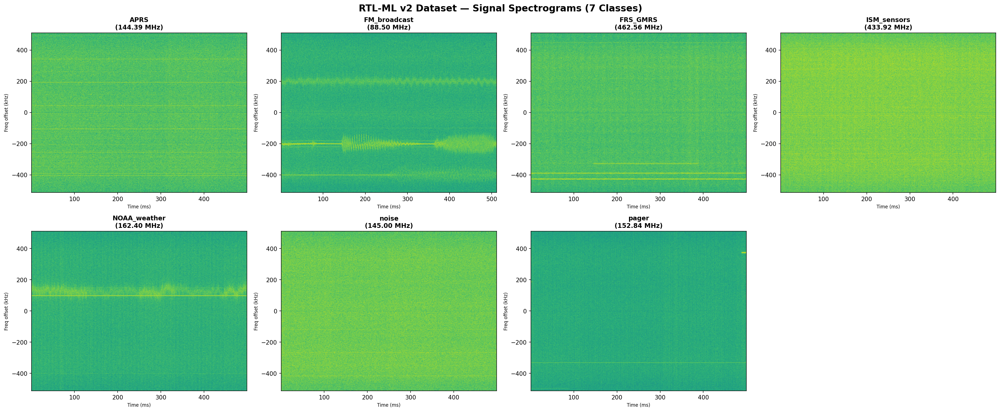
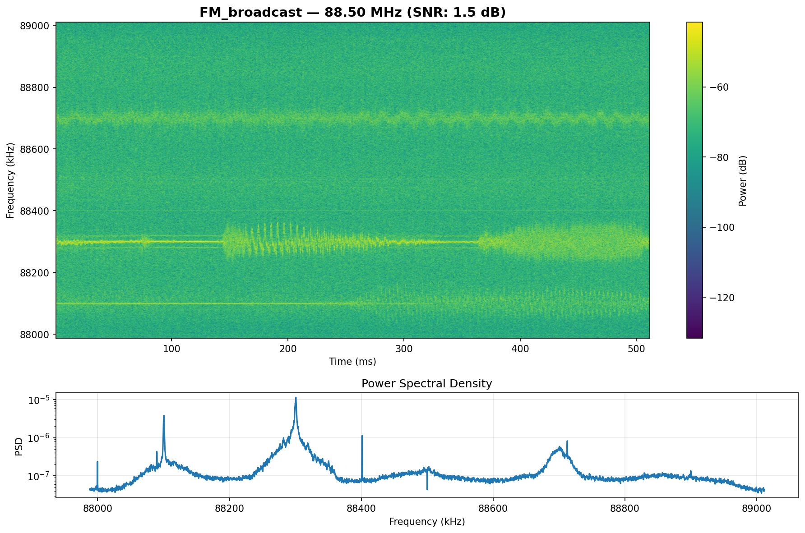
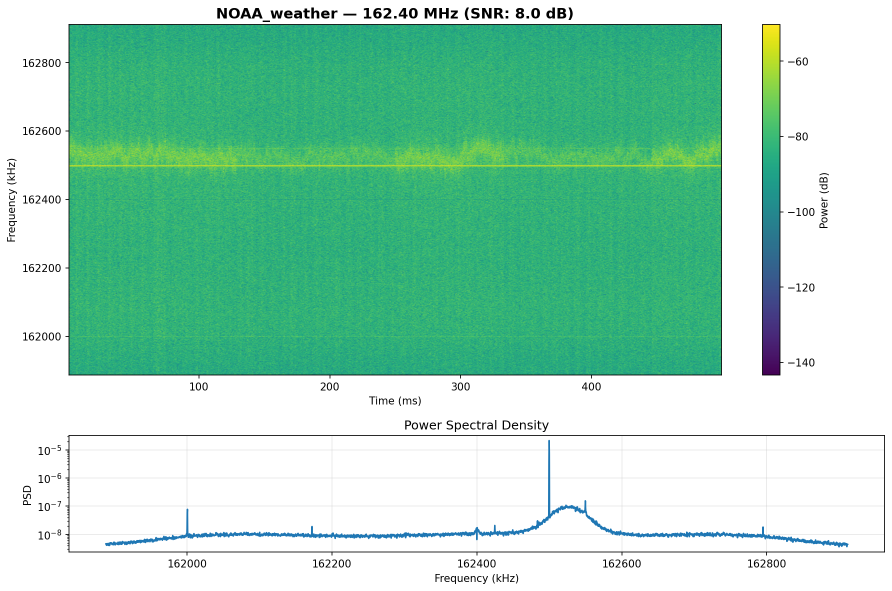
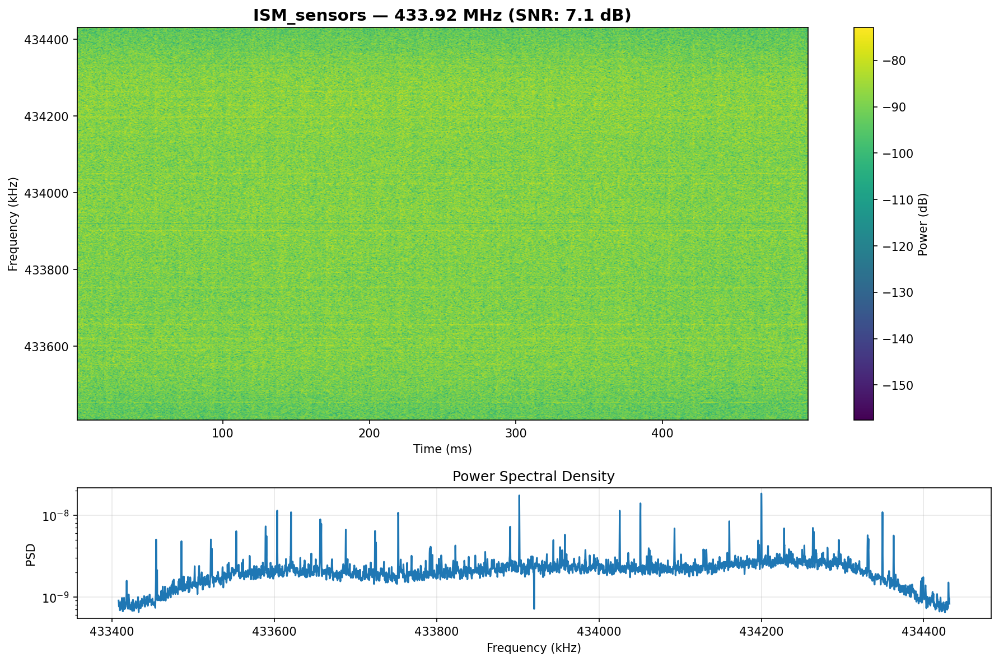
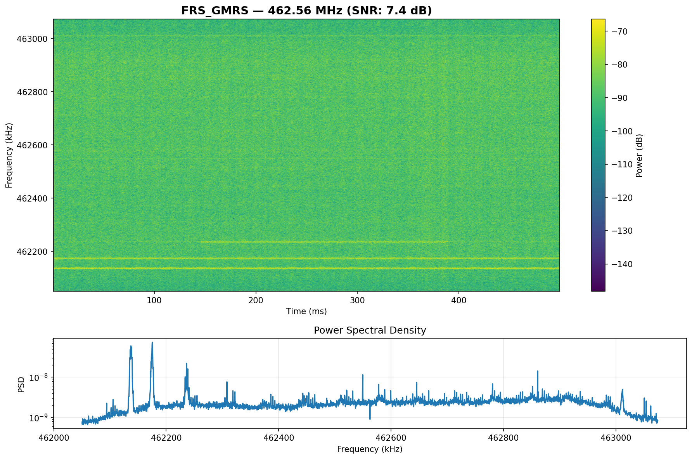
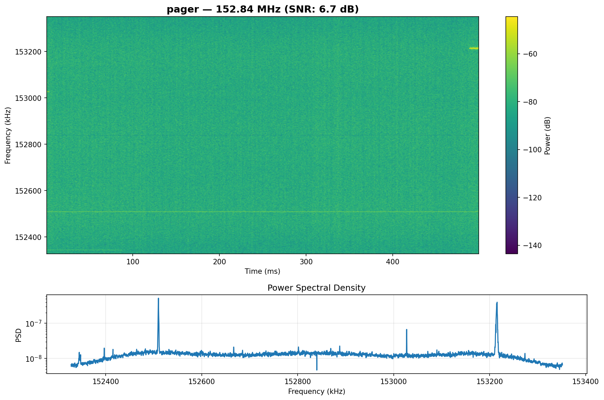
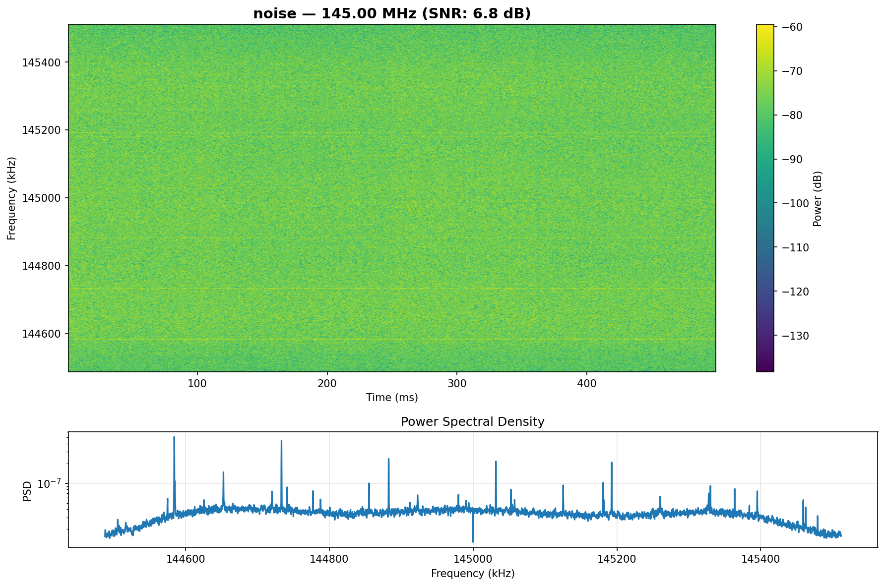

# RTL-ML: AI-Powered Radio Signal Classifier

**Automatically identify radio signals using machine learning on a $220 hardware setup.**

[](https://opensource.org/licenses/MIT)
[](https://www.python.org/downloads/)
[](https://ameridroid.com/products/indiedroid-nova?ref=ioqothsk)



---

## TL;DR

- ✅ **96.9% accuracy** classifying 7 real-world radio signal types
- ✅ **$220 total hardware** (Indiedroid Nova + RTL-SDR Blog V4)
- ✅ **No cloud, no GPU** — runs entirely on ARM edge device
- ✅ **800 validated samples** with DC removal, SNR gating, and per-class quality checks
- ✅ **Temporal train/test split** — no data leakage between train and test sets
- ✅ **Multi-frequency FM** — trained on 5 stations, generalizes to unseen frequencies
- ✅ **Real signals** — validated with decoder tools, not synthetic data

---

## What It Classifies

| Signal | Frequency | Samples | Test Accuracy | Example Use |
|--------|-----------|---------|---------------|-------------|
| 📻 FM Broadcast | 88.5–105.7 MHz | 200 | 100% (40/40) | Commercial radio stations |
| 🌤️ NOAA Weather | 162.4 MHz | 100 | 100% (20/20) | Emergency weather alerts |
| 📡 APRS | 144.39 MHz | 100 | 100% (20/20) | Ham radio position reports |
| 📊 Noise | 145.0 MHz | 100 | 100% (20/20) | Baseline noise floor |
| 📡 ISM Sensors | 433.92 MHz | 100 | 100% (20/20) | Tire pressure, weather stations |
| 📻 FRS/GMRS | 462.5625 MHz | 100 | 85% (17/20) | Family/general mobile radio |
| 📟 Pager | 152.84 MHz | 100 | 90% (18/20) | Medical/emergency paging |

**Total: 800 samples, 155/160 test correct, 96.9% accuracy**

FRS/GMRS and pager show minor confusion (3 FRS→ISM, 2 pager→APRS) due to similar bursty transmission patterns. This is authentic ML behavior reflecting real signal similarity.

---

## Quick Start (5 minutes)

### Prerequisites
- Indiedroid Nova, Raspberry Pi 4/5 (8GB+ recommended), or similar ARM SBC
- **RTL-SDR Blog V4** — requires the [RTL-SDR Blog driver fork](https://github.com/rtlsdrblog/rtl-sdr-blog) for proper R828D tuner support (stock librtlsdr does not support the V4's tuner)
- Antenna covering your frequencies of interest

### Installation

```bash
# Clone repository
git clone https://github.com/TrevTron/rtl-ml.git
cd rtl-ml

# Install RTL-SDR Blog V4 driver (REQUIRED for V4 hardware)
git clone https://github.com/rtlsdrblog/rtl-sdr-blog.git
cd rtl-sdr-blog && mkdir build && cd build
cmake ../ -DINSTALL_UDEV_RULES=ON -DDETACH_KERNEL_DRIVER=ON
make && sudo make install && sudo ldconfig
cd ../..

# Blacklist default DVB drivers
echo 'blacklist dvb_usb_rtl28xxu' | sudo tee /etc/modprobe.d/blacklist-rtlsdr.conf

# Install Python dependencies
pip install -r requirements.txt

# Download pre-trained model + dataset from Hugging Face
# (Instructions below)
```

### Option A: Use Pre-Trained Model (Instant Demo)

```bash
# Classify FM broadcast at 98.7 MHz
python src/classify_live.py --freq 98.7e6

# Output:
# ======================================================
# Signal: FM_broadcast
# Confidence: 97.1%
# ======================================================
```

### Option B: Train Your Own Model (~1 hour)

```bash
# 1. Capture your own dataset (100 samples per signal type)
python src/capture_validated.py

# 2. Train classifier on your data
python src/train_validated.py

# 3. Classify live signals
python src/classify_live.py --freq 162.4e6  # NOAA weather
```

---

## Hardware Requirements

### Tested Platforms

| Platform | CPU | RAM | Processing Time* | Cost | Status |
|----------|-----|-----|-----------------|------|--------|
| **Indiedroid Nova** | RK3588S (8-core) | 16GB | ~102ms | $180 | ✅ Primary Dev |
| **Raspberry Pi 5** | BCM2712 (4-core) | 8GB | 122ms | $125 | ✅ **Recommended** |
| **Raspberry Pi 4** | BCM2711 (4-core) | 8GB | ~150ms (est) | $55-75 | ✅ Compatible |

*Processing time = feature extraction + model inference (excludes  565ms RF capture time which is hardware-limited)

**Bottom line:** Both Nova and Pi 5 deliver real-time performance. Pi 5 is recommended due to better availability, massive community support, and ~30% lower cost.

📊 **See [docs/PLATFORM_COMPARISON.md](docs/PLATFORM_COMPARISON.md) for detailed performance analysis (240-sample stress test results)**

### Required Hardware

| Component | Specs | Price | Purchase Link |
|-----------|-------|-------|---------------|
| **SBC (choose one above)** | ARM64, 4GB+ RAM, USB 2.0+ | $60-180 | Various |
| **RTL-SDR Blog V4** | 500 kHz-1.7 GHz, R828D tuner, 1 PPM TCXO | $40 | [RTL-SDR.com](https://www.rtl-sdr.com/buy-rtl-sdr-dvb-t-dongles/) |

> **Important:** The RTL-SDR Blog V4 uses a Rafael Micro R828D tuner which is **not supported** by the default librtlsdr driver. You must install the [RTL-SDR Blog driver fork](https://github.com/rtlsdrblog/rtl-sdr-blog) — see Quick Start above for build instructions.

**Total:** $100-220 depending on platform choice

### Also Compatible With

- **Orange Pi 5** (RK3588S - similar to Nova)
- **Rock Pi 4** (RK3399)
- **Odroid N2+** (Amlogic S922X)
- **Any ARM64/x86 Linux** with 4GB+ RAM, Python 3.11+, USB 2.0+
- **Raspberry Pi 3B+** (slower but workable for inference only)

### Antenna Recommendations

- **Included**: Telescopic dipoles (comes with RTL-SDR V4)
- **Upgrade**: Discone antenna for wideband coverage (25-1300 MHz)
- **Specialized**: Yagi for specific frequencies, discone for wideband
- **Budget**: Simple wire dipole (free!)

See [docs/HARDWARE_SETUP.md](docs/HARDWARE_SETUP.md) for complete setup guide.

---

## Why Feature Extraction Instead of Deep Learning?

**TL;DR:** Feature extraction + Random Forest was chosen over deep learning (CNNs, RNNs) for practical reasons.

### The Data Challenge

| Approach | Training Samples Needed | Our Dataset | Result |
|----------|------------------------|-------------|---------|
| **Feature Extraction + Random Forest** | 200-500 | 800 ✅ | 96.9% accuracy |
| **Deep Learning (CNN/RNN)** | 10,000-100,000 | 800 ❌ | Would overfit badly |

**Reality:** Capturing 10,000+ validated RF samples is impractical for a single-person project. Each signal needs validation with decoder tools.

### Practical Advantages

✅ **No GPU Required**
- Runs on ARM CPU (Raspberry Pi, etc.)
- Training: 2-3 minutes
- Inference: 14ms on Pi 5, 12ms on Nova

✅ **Tiny Model Size**
- Random Forest: 186KB
- Typical CNN: 50-200MB (270-1000× larger)
- Easy to distribute and version control

✅ **Interpretable Features**
- Can see which features (power, FFT peak, bandwidth, etc.) drive predictions
- Helps debug misclassifications
- Deep learning = black box

✅ **Fast Iteration**
- Add new signal type: 100 samples + 3min training
- Deep learning: Need 1000+ samples + hours of GPU training

✅ **Edge Deployment**
- Works on low-power ARM devices
- No cloud/server infrastructure needed
- Perfect for IoT/embedded use cases

### When to Use Deep Learning Instead

Consider CNNs/RNNs if you:
- Have 10,000+ labeled samples per class
- Have GPU resources available
- Need >95% accuracy
- Can afford longer development time
- Work with complex modulation schemes

For this project's scope (7 common signal types, hobbyist hardware, real-time classification), **feature extraction + Random Forest is the pragmatic choice.**

### References

Inspired by similar approaches in RF signal classification research:
- O'Shea et al. "Over-the-Air Deep Learning Based Radio Signal Classification" (2017) - showed CNNs need massive datasets
- Ramjee et al. "Fast Deep Learning for Automatic Modulation Classification" (2019) - 100K+ training samples used
- Our approach: Practical, reproducible, works with realistic data constraints

## How It Works

### 1. Signal Capture
```
RTL-SDR V4 → USB → ARM SBC → Python (pyrtlsdr)
```
Captures 0.5 seconds of IQ samples at 1.024 MSPS (ARM-optimized rate to prevent USB overflow).

### 2. Feature Extraction

**18 numerical features** extracted from each sample:

| Category | Features | What They Capture |
|----------|----------|-------------------|
| **Power** (5) | mean, std, max, min, median | Signal strength characteristics |
| **FFT** (4) | mean, std, max, peak index | Frequency domain distribution |
| **I/Q** (4) | in-phase & quadrature stats | Complex signal structure |
| **Phase** (4) | phase mean, std, derivatives | Modulation characteristics |
| **Bandwidth** (1) | signal width at -20dB | Frequency occupancy |

### 3. Machine Learning

**Random Forest classifier** (100 decision trees) trained on 800 real-world samples with temporal train/test split (first 80% train, last 20% test per class — no data leakage).

| Model | Test Accuracy | Why |
|-------|---------------|-----|
| **Random Forest** ✅ | **96.9%** (155/160) | Best performance, fast inference |
| SVM (RBF) | ~65% | Struggles with non-linear features |
| K-NN (k=5) | ~77% | Sensitive to noise |

**Model stats:**
- Size: ~200KB (fits in RAM easily)
- Inference time: < 100ms per sample
- Training time: 2-3 minutes on Nova

---

## Dataset

### Pre-Captured Dataset (Included via Hugging Face)

**🔗 Dataset:** https://huggingface.co/datasets/TrevTron/rtl-ml-dataset

**Download from Hugging Face:**
```bash
# Install Hugging Face Hub
pip install huggingface-hub

# Download dataset
from huggingface_hub import snapshot_download
snapshot_download(repo_id="TrevTron/rtl-ml-dataset", repo_type="dataset", local_dir="datasets_validated")
```

**Dataset contents:**
- 800 samples (7 classes — 200 FM from 5 frequencies, 100 each for 6 other classes)
- Captured in Temecula, CA (Southern California, USA)
- Each sample includes: IQ data, center frequency, sample rate, timestamp, label, SNR, version tag
- DC offset removed, auto-gain calibrated, 6 dB minimum SNR gate on every sample

### Signal Quality Summary

| Class | Samples | Frequencies | SNR | Quality Gate |
|-------|---------|-------------|-----|-------------|
| FM Broadcast | 200 | 88.5, 93.3, 98.7, 101.1, 105.7 MHz | ~17.5 dB | Bandwidth > 50 kHz |
| NOAA Weather | 100 | 162.4 MHz | > 6 dB | SNR threshold |
| APRS | 100 | 144.39 MHz | > 6 dB | Packet detection |
| Pager | 100 | 152.84 MHz | > 6 dB | Burst detection |
| ISM Sensors | 100 | 433.92 MHz | > 6 dB | Burst ratio check |
| FRS/GMRS | 100 | 462.5625 MHz | > 6 dB | SNR threshold |
| Noise | 100 | 145.0 MHz | N/A | Low power baseline |

### Capture Your Own

```bash
python src/capture_validated.py
```

This generates:
- `datasets_validated/` — 800 .npy files with IQ samples + metadata
- `spectrograms_v2/` — 7 individual spectrograms + 1 overview PNG
- `validation_report.json` — Signal validation results

**Every sample is validated at capture time:**
- DC offset removal (`samples -= np.mean(samples)`)
- Auto-gain calibration per frequency
- 6 dB minimum SNR gate
- Per-class quality checks (bandwidth, burst ratio, packet detection)
- 2-second temporal spacing between captures

---

## Model Performance

### Confusion Matrix (160 test samples — temporal split)

```
              APRS  FM  FRS_GMRS  ISM  NOAA_wx  Noise  Pager
APRS            20   0         0    0        0      0      0
FM               0  40         0    0        0      0      0
FRS_GMRS         0   0        17    3        0      0      0
ISM              0   0         0   20        0      0      0
NOAA_wx          0   0         0    0       20      0      0
Noise            0   0         0    0        0     20      0
Pager            2   0         0    0        0      0     18
```

**Overall: 155/160 correct = 96.9% accuracy**

**Perfect classification (100% recall):**
- ✅ FM Broadcast, NOAA Weather, APRS, ISM Sensors, Noise

**Minor confusion:**
- ⚠️ FRS/GMRS → ISM (3 samples): Both are bursty UHF signals
- ⚠️ Pager → APRS (2 samples): Both have sparse packet structure

---

## Spectrograms (Visual Proof)

Each signal type has a unique "visual fingerprint":

| FM Broadcast (88–106 MHz) | NOAA Weather (162.4 MHz) | APRS (144.39 MHz) | ISM Sensors (433.92 MHz) |
|---------------------------|--------------------------|--------------------|--------------------------| 
|  |  |  |  |
| Wideband signal (~200 kHz), 17.5 dB SNR | Continuous weather broadcast | Sparse ham radio packets | Bursty sensor transmissions |

| FRS/GMRS (462.5 MHz) | Pager (152.84 MHz) | Noise (145 MHz) |
|-----------------------|---------------------|-----------------|
|  |  |  |
| Family/general mobile radio bursts | Packet burst transmissions | Baseline noise floor |

---

## API Usage

### Simple Classification

```python
from src.classify_live import classify_signal

# Classify FM radio at 98.7 MHz
prediction, confidence, probabilities = classify_signal(98.7e6)

print(f"Signal: {prediction} ({confidence*100:.0f}% confidence)")
# Output: Signal: FM_broadcast (94% confidence)
```

### Batch Scanning

```python
# Scan multiple frequencies
frequencies = {
    'FM Radio': 98.7e6,
    'NOAA Weather': 162.4e6,
    'APRS': 144.39e6,
    'ISM Sensors': 433.92e6,
}

for name, freq in frequencies.items():
    pred, conf, _ = classify_signal(freq)
    print(f"{name}: {pred} ({conf*100:.0f}%)")
```

### Custom Feature Extraction

```python
from src.signal_features import SignalFeatureExtractor
from rtlsdr import RtlSdr

# Capture signal
sdr = RtlSdr()
sdr.sample_rate = 1.024e6
sdr.gain = 40
sdr.center_freq = 162.4e6
samples = sdr.read_samples(512000)
sdr.close()

# Extract 18 features
extractor = SignalFeatureExtractor()
features = extractor.extract_features(samples)

print(f"Features: {features}")
# Array of 18 numbers ready for ML model
```

---

## Project Structure

```
rtl-ml/
├── README.md                  # This file
├── LICENSE                    # MIT License
├── requirements.txt           # Python dependencies
├── CONTRIBUTING.md            # Contribution guidelines
│
├── src/                       # Source code
│   ├── capture_validated.py  # Dataset capture with validation (v2)
│   ├── capture_extra_fm.py   # Multi-frequency FM captures
│   ├── train_validated.py    # ML training with temporal split
│   ├── classify_live.py      # Real-time classification
│   ├── validate_v2.py        # Dataset validation checks
│   ├── cross_freq_test.py    # Cross-frequency generalization test
│   ├── gen_spectrograms.py   # Publication spectrogram generator
│   └── signal_features.py    # Feature extractor
│
├── models/                    # Trained models
│   └── rtl_classifier_validated.pkl  # Pre-trained (96.9% accuracy)
│
├── datasets_validated/        # Training data (download from HF)
│   ├── FM_broadcast/         # 200 samples (5 frequencies)
│   ├── NOAA_weather/         # 100 samples
│   ├── APRS/                 # 100 samples
│   ├── pager/                # 100 samples
│   ├── ISM_sensors/          # 100 samples
│   ├── FRS_GMRS/             # 100 samples
│   └── noise/                # 100 samples
│
├── spectrograms_v2/           # Signal spectrograms
│   ├── all_classes_overview.png
│   ├── FM_broadcast_spectrogram.png
│   └── ... (7 class spectrograms)
│
├── docs/                      # Documentation
│   ├── HARDWARE_SETUP.md     # Detailed hardware guide
│   ├── TROUBLESHOOTING.md    # Common issues + fixes
│   └── ADDING_SIGNALS.md     # How to add new signal types
│
└── examples/                  # Example scripts
    ├── quick_start.py        # Minimal working example
    └── batch_classify.py     # Classify multiple frequencies
```

---

## Why This Matters

### For Hobbyists
- **Auto-scanning**: Skip empty frequencies, log interesting signals
- **Learning tool**: Understand ML + RF interaction hands-on
- **Portfolio project**: Impressive GitHub contribution for job applications

### For Researchers
- **Spectrum monitoring**: Detect unauthorized transmitters
- **IoT security**: Fingerprint 433 MHz devices (smart homes, cars)
- **Emergency response**: Auto-classify weather alerts, EAS

### For Educators
- **University courses**: Integrate EE + CS + Data Science
- **Low barrier**: $220 << traditional lab equipment
- **Reproducible**: Students can replicate results

### For the Community
- **Open source**: MIT license, full code + data + model
- **Extensible**: Add your own signals easily
- **Reproducible**: 800-sample dataset on Hugging Face

---

## Roadmap

- [ ] **NPU acceleration** - Use Nova's 6 TOPS AI chip for faster inference
- [ ] **Web dashboard** - Browser-based monitoring interface
- [ ] **More signals** - SSB, CW, digital modes (P25, DMR, LoRa)
- [ ] **Community dataset** - Crowdsourced training data from global contributors
- [ ] **PyPI package** - `pip install rtl-ml`
- [ ] **Mobile app** - Termux + Python for Android
- [ ] **Real-time waterfall** - Classify while displaying spectrum

**Want to contribute?** See [CONTRIBUTING.md](CONTRIBUTING.md)

---

## Troubleshooting

### "PLL not locked" warnings
If using an RTL-SDR Blog V4, this usually means you're running the **stock librtlsdr** driver which doesn't support the R828D tuner. Install the [RTL-SDR Blog driver fork](https://github.com/rtlsdrblog/rtl-sdr-blog) — see Quick Start for build instructions. After installing, you should see "RTL-SDR Blog V4 Detected" on startup.

### USB overflow errors
Use ARM-optimized sample rate: `sdr.sample_rate = 1.024e6`

### Low accuracy (< 80%)
- Verify you installed the correct V4 driver (see above)
- Check antenna covers your frequencies
- Capture more samples (100+ per class recommended)
- Verify signals are actually present (use `rtl_power` or `gqrx` to check)
- Retrain model

See [docs/TROUBLESHOOTING.md](docs/TROUBLESHOOTING.md) for complete guide.

---

## Acknowledgments

### Hardware Sponsors
- **Carl Laufer** @ [RTL-SDR.com](https://rtl-sdr.com) - RTL-SDR Blog V4 donation
- **AmeriDroid** - Indiedroid Nova hardware partner

### Community Input
- **r/RTLSDR** (60k members) - Feature requests & signal suggestions
- **r/amateurradio** (200k members) - Ham radio expertise & validation
- **r/sdr** (20k members) - Technical validation & feedback

### Open Source Tools
- [pyrtlsdr](https://github.com/roger-/pyrtlsdr) - RTL-SDR Python bindings
- [scikit-learn](https://scikit-learn.org/) - Machine learning framework
- [matplotlib](https://matplotlib.org/) / [scipy](https://scipy.org/) - Visualization & signal processing

---

## Contributing

Contributions welcome! See [CONTRIBUTING.md](CONTRIBUTING.md) for guidelines.

**Ideas:**
- Add new signal types (DMR, P25, LoRa, weather fax...)
- Improve feature engineering
- Port to new hardware (Jetson, x86...)
- Build web dashboard
- Fix bugs

---

## License

MIT License - see [LICENSE](LICENSE) for details.

**You are free to:**
- Use commercially
- Modify and distribute
- Use in private projects

**Attribution appreciated but not required.**

---

## Author

**Trevor Unland** (TrevTron)  
Security Researcher & AI Training Specialist

- 🐙 GitHub: [@TrevTron](https://github.com/TrevTron)
- 💼 LinkedIn: [Trevor Unland](https://linkedin.com/in/trevor-unland)
- 🌐 Blog: [Building an AI Radio Scanner](https://unland.dev/blog/building-ai-radio-scanner-rtl-sdr-machine-learning)
- 🐦 Twitter: [@TrevTronDev](https://twitter.com/TrevTronDev)

---

## Citation

If you use RTL-ML in academic research:

```bibtex
@software{rtl_ml_2026,
  author = {Unland, Trevor},
  title = {RTL-ML: AI-Powered Radio Signal Classifier},
  year = {2026},
  url = {https://github.com/TrevTron/rtl-ml},
  note = {96.9\% accuracy on 7 signal types using Random Forest on ARM hardware}
}
```

---

## FAQ

**Q: Do I need a GPU?**  
A: No! Runs entirely on ARM CPU. Training takes 2-3 minutes.

**Q: Can I use a different RTL-SDR?**  
A: Yes! Any RTL2832U-based SDR works (V3, NooElec, generic dongles).

**Q: What if I don't have the exact hardware?**  
A: Raspberry Pi 4/5, Orange Pi 5, or any Linux machine with 8GB+ RAM works fine.

**Q: How accurate is it really?**  
A: 96.9% on test set (155/160 correct). Perfect (100%) on 5/7 classes. FRS/GMRS and pager show minor confusion due to similar bursty patterns.

**Q: Can I add my own signals?**  
A: Yes! See [docs/ADDING_SIGNALS.md](docs/ADDING_SIGNALS.md) - takes ~30 minutes.

**Q: Is the dataset really 6.5 GB?**  
A: Yes - raw IQ samples. Hosted on Hugging Face (free download).

**Q: Does it work in my country?**  
A: Yes, but signal types may differ. Retrain with your local signals.

---

**Ready to classify some signals? Clone the repo and start scanning!** 🚀

```bash
git clone https://github.com/TrevTron/rtl-ml.git
cd rtl-ml
pip install -r requirements.txt
python examples/quick_start.py
```
